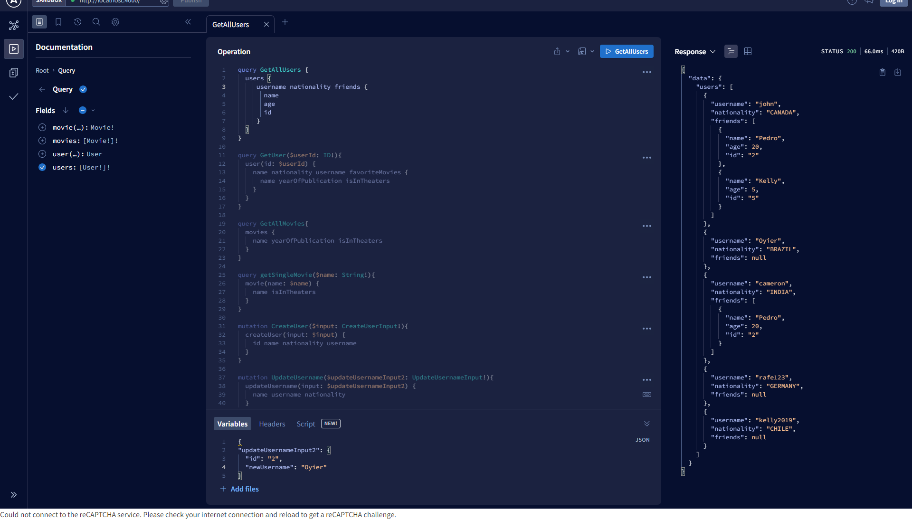

# GraphQL

Mastering the fundamentals of querying and mutations on GraphQL using Apollo Client.

### Queries run on Apollo Client:



```graphql
query GetAllUsers {
	users {
		username
		nationality
		friends {
			name
			age
			id
		}
	}
}

query GetUser($userId: ID!) {
	user(id: $userId) {
		name
		nationality
		username
		favoriteMovies {
			name
			yearOfPublication
			isInTheaters
		}
	}
}

query GetAllMovies {
	movies {
		name
		yearOfPublication
		isInTheaters
	}
}

query getSingleMovie($name: String!) {
	movie(name: $name) {
		name
		isInTheaters
	}
}

mutation CreateUser($input: CreateUserInput!) {
	createUser(input: $input) {
		id
		name
		nationality
		username
	}
}

mutation UpdateUsername($updateUsernameInput2: UpdateUsernameInput!) {
	updateUsername(input: $updateUsernameInput2) {
		name
		username
		nationality
	}
}
```

## Authors

Project contributed to and maintained by:

- [Bob Oyier](https://github.com/oyieroyier/)

### ISC License (ISC)

[](https://opensource.org/licenses/ISC)
